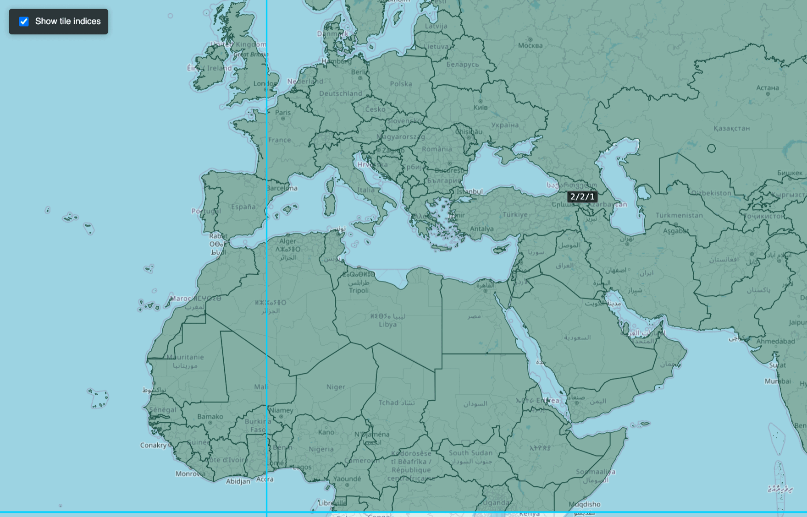

# Starlet

**Turn large geospatial datasets into fast, interactive maps.** Starlet
partitions a GeoParquet / GeoJSON file into spatial tiles, generates
[Mapbox Vector Tiles](https://github.com/mapbox/vector-tile-spec), and serves
them over HTTP with a built-in web viewer — all from a single command-line tool.



## Install

```bash
pip install starlet
```

Requires Python 3.10+. On systems where `pip` points at Python 2, use `pip3`:

```bash
pip3 install starlet
```

This installs the `starlet` command-line tool. Check it:

```bash
starlet --version
```

## Quick start

Go from a data file to a live map in two commands:

```bash
# 1. Build a dataset: partition into tiles + pre-generate vector tiles
starlet build --input data.parquet --outdir datasets/mydata

# 2. Serve it
starlet serve --dir datasets --port 8765
```

Open <http://localhost:8765> and pick your dataset to explore it on a map.


## Commands

Everything runs through the `starlet` CLI. Run `starlet <command> --help` for the
full option list.

| Command | What it does |
|---------|--------------|
| `starlet build` | Full pipeline: partition **and** generate vector tiles |
| `starlet tile`  | Partition a dataset into spatial Parquet tiles only |
| `starlet mvt`   | Generate vector tiles from an already-tiled dataset |
| `starlet serve` | Run the HTTP tile server + web viewer |
| `starlet info`  | Print a summary of a dataset (tiles, bbox, zoom levels) |

### The options you'll actually use

| Option | Commands | Default | Description |
|--------|----------|---------|-------------|
| `--input` / `--outdir` | build, tile | required | Source file and output dataset directory |
| `--zoom` | build, mvt | `7` | Maximum vector-tile zoom level |
| `--geom-col` | build, tile | `geometry` | Geometry column name (use `wkb_geometry` for OGR/`ogr2ogr` exports) |
| `--partition-size` | build, tile | `128mb` GeoParquet / `512mb` GeoJSON | Target tile size, e.g. `256mb`, `1gb` |
| `--pmtiles` | build, mvt | off | Also export a single `.pmtiles` archive |
| `--threshold` | build, mvt | `0` | Minimum feature count for a tile to be generated |
| `--dir` | serve, mvt, info | required | Dataset directory (or the root of several, for `serve`) |
| `--port` | serve | `8765` | Port to bind the server |

### Examples

```bash
# Build to a deeper zoom (more detail when you zoom in)
starlet build --input roads.parquet --outdir datasets/roads --zoom 12

# GeoJSON input, custom geometry column
starlet build --input places.geojson --outdir datasets/places --geom-col wkb_geometry

# Serve a whole folder of datasets; the viewer lists them all
starlet serve --dir datasets --port 8765

# Inspect what got built
starlet info --dir datasets/roads
```

## Input formats

Starlet reads **GeoParquet**, **GeoJSON**, and **CSV** (with either `x`/`y`
columns or a WKT column — see `starlet tile --help`). Source data is assumed to
be longitude/latitude (EPSG:4326); tiles are produced in Web Mercator
(EPSG:3857).

## One-file distribution with PMTiles

Pass `--pmtiles` to pack every generated tile into a single
[PMTiles](https://github.com/protomaps/PMTiles) archive — handy for shipping a
dataset as one file or hosting it on static storage:

```bash
starlet build --input data.parquet --outdir datasets/mydata --pmtiles
```

## Server API

While `starlet serve` is running:

| Method | Path | Description |
|--------|------|-------------|
| `GET` | `/` | Interactive dataset browser |
| `GET` | `/api/datasets` | List available datasets |
| `GET` | `/<dataset>/<z>/<x>/<y>.mvt` | A Mapbox Vector Tile |
| `GET` | `/datasets/<dataset>.json` | Dataset metadata (bbox, zoom range) |
| `GET`/`POST` | `/datasets/<dataset>/features.<csv\|geojson>` | Download features (optional geometry filter) |
| `GET` | `/api/datasets/<dataset>/stats` | Per-attribute statistics |

Tiles are served in tiers — an in-memory LRU cache, then a pre-generated
PMTiles archive or `.mvt` files on disk, then generated on the fly from the
Parquet tiles when you zoom past the pre-built levels — so you can serve a
dataset even without pre-generating every zoom.

## Configuration

Settings you reuse often (partition size, zoom, worker count, …) can live in a
`starlet.toml` file instead of being passed on every command. Copy
[`starlet.toml.example`](starlet.toml.example) to `starlet.toml` and edit it;
Starlet loads it automatically. CLI flags always override the file. See
[docs/CONFIGURATION.md](docs/CONFIGURATION.md) for the full list of keys.

## Deploying a server

[docs/DEPLOYMENT.md](docs/DEPLOYMENT.md) walks through standing up a production
tile server, including a no-root recipe behind an existing Apache install.

## Using Starlet from Python

`starlet` is also importable — `tile()`, `generate_mvt()`, `build()`,
`export_pmtiles()`, and `create_app()` are documented in
[docs/PUBLIC_API.md](docs/PUBLIC_API.md).

---

**Want to work on Starlet itself** — run it from a clone, run the tests, or
contribute a change? See **[DEVELOPMENT.md](DEVELOPMENT.md)**.

## License

Starlet is distributed under the MIT License.
